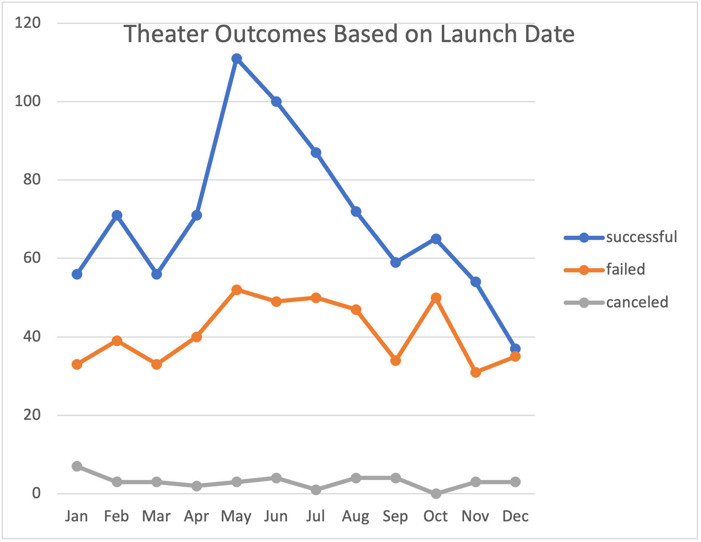
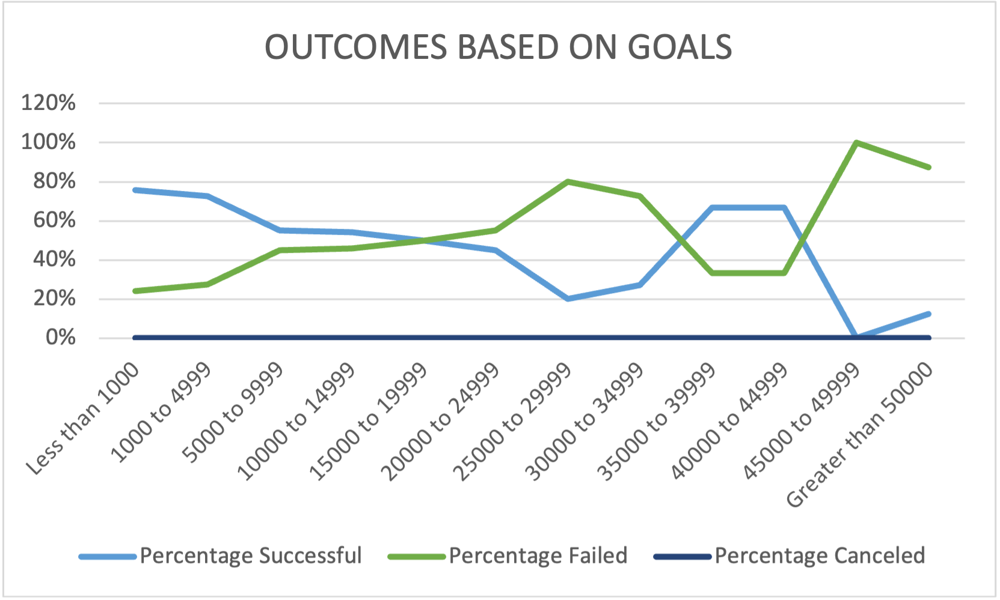

# Kickstarter Challenge

## Project Overview

This project is to help analyse and study how different fund raising campaigns fared against their respective goals and their launch dates, in the theater and stage entertainment industry. The purpose of this analysis is to help Louise, an aspiring playwright who is about to start a crowdfunding campaign to raise funds for her upcoming play.

## Analysis and Challenges

### Theater Outcomes by launch date

In order to address the client requirements mentioned above, the data has been filtered for the theater category and the number of campaigns that were successful, failed or cancelled are displayed against the launch month for every year. The relevant table can be found in this excel file.
[Kickstarter_Challenge](Kickstarter_Challenge.xlsx).

 The same can be visualized here.

The primary challenge here was the spread of campaign launch dates across several years. First the launch dates had to be converted into a more readable format and then the year extracted from the date. A pivot table was created with a filter by Year and data was further categorized by months.  It is now possible to view campaign outcomes by month for All Years or for specific years. 

### Outcomes Based on Goals

The number and percentage of successful, failed and canceled campaigns for plays have been calculated against goal ranges - ranging from less than $1000 up to greater than $50000.The relevant table can be found in this excel file.
[Kickstarter_Challenge](Kickstarter_Challenge.xlsx).

The same has been represented here.

The challenge here was the wide variety of fundraising goals. In order to address this the goals have been grouped into ranges and number of campaigns filtered and displayed within those ranges.

## Results

### Theater Outcomes by Launch Date - Conclusions

It can be observed that theater campaigns with launch dates in the summer months of May to August have been most successful in reaching their goals. Even though the number of failed campaigns is comparatively higher in the summer months as well, the difference between the number of successful and failed campaigns is also large during this time period, meaning there are more sucessful than failed campaigns during these months.

The number of canceled campaigns is highest for those with launch date in January, implying that January may be too early in the year to launch a campaign.

### Outcomes based on goals - Conclusions

There is an inverse relationship between the fundraising goal for plays and the number of successful campaigns. As the goal gets higher, the percentage of successful campaigns gets lower. The campaigns are most sucessful when the fundraising goal is less than $5000. The campaigns have close to 50-50 chance of sucess or failure when the goal is between $5000 and $20000. Anything above this goal amount has a greater chance for failure.

### Data Limitations

The following limitations were observed :

- Some values like dates needed some additional formatting to make it more readable.
- Data Integrity comes into question as there are several categories such as restaurants, books, wearables,gadgets etc. whose campaigns have also been included in the data.
- Also, there are some campaigns with very low goal amounts ( less than $50). These are either not relevant categories or may be errors because they raise a lot more money than the goal. This may skew the data as they are all listed as successful outcomes.
- Some Outliers can also be seen in the Goals column.
- Where the campaigns happened or median income of the places where the campaigns happened would have been a useful data point to have for further analysis.
- What platforms were used for the Fundraising campaigns and a breakdown of how much was raised under each platform, would have been an additional useful data point.

### Other tables and graphs

The following additional tables and graphs can be created for further analysis.

- A Stacked Bar Graph that shows outcomes by categories 
- A stacked bar graph that shows outcomes by sub-categories.
- Campaign Outcomes filtered by country and category.
- A simple bar graph to show the number of backers by category/ sub category
- Outcomes by duration of campaign- A Line chart to show the number / percentage of successful , failed and canceled projects based on duration of campaign.
- Box and Whisker Plot to show the measures of Central tendency, the measures of spread and outliers for Goal and Pledged amounts

